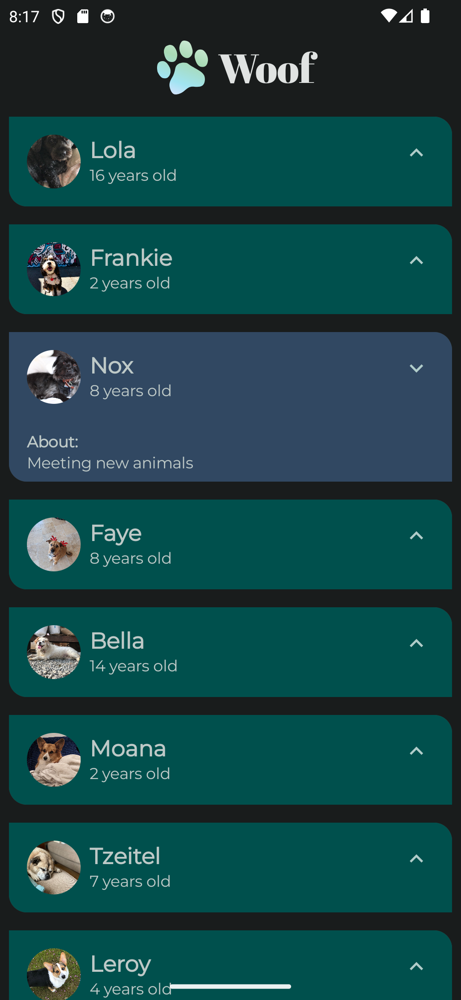

# Woof App

Woof is a delightful mobile application designed to bring joy to dog lovers by showcasing pictures of adorable dogs along with their names, ages, and hobbies. This app follows the Material Design 3 guidelines, providing a modern and intuitive user experience. Built using Kotlin Jetpack Compose, Woof incorporates animations and supports both light and dark themes for personalized viewing.

## Features

- **Dog Cards**: View pictures of dogs along with their names, ages, and hobbies presented in beautifully designed cards.
- **Material Design 3**: Follows the latest Material Design 3 guidelines for a visually appealing and consistent user interface.
- **Animations**: Enjoy smooth and engaging animations to enhance the user experience.
- **Light and Dark Theme**: Supports both light and dark themes, allowing users to choose their preferred viewing mode.

## Technologies Used

- Kotlin Jetpack Compose: Modern toolkit for building native Android UI.
- Material Design 3: Design language for creating intuitive and visually appealing user interfaces.
- Android Animation API: Utilized for creating fluid animations within the app.

## Screenshots



## Getting Started

To get started with Woof, follow these steps:

1. **Clone the Repository**: 
   ```
   git clone https://github.com/IbrahimAlsaudi/woof-app.git
   ```
2. **Open in Android Studio**: 
   Open the project in Android Studio.
3. **Build and Run**: 
   Build the project and run it on an emulator or a physical device.

## Contributing

Contributions are welcome! If you'd like to contribute to Woof, please feel free to do so!
